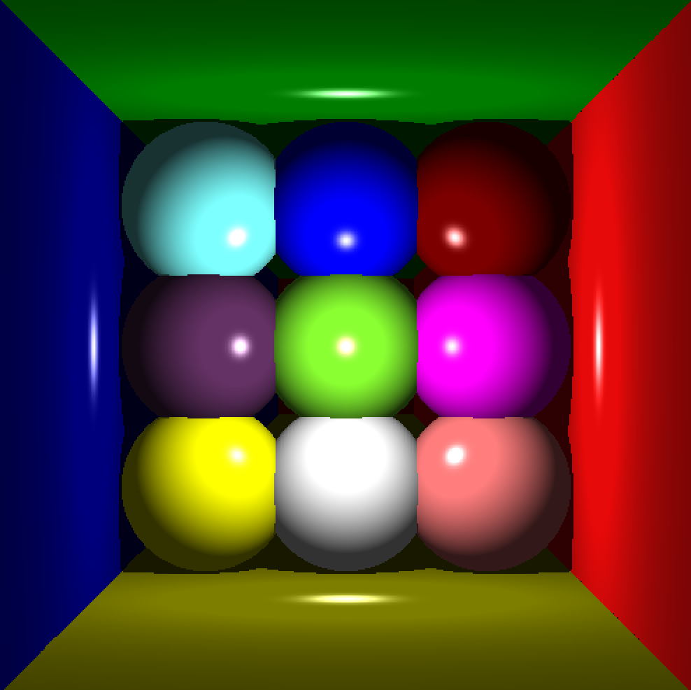
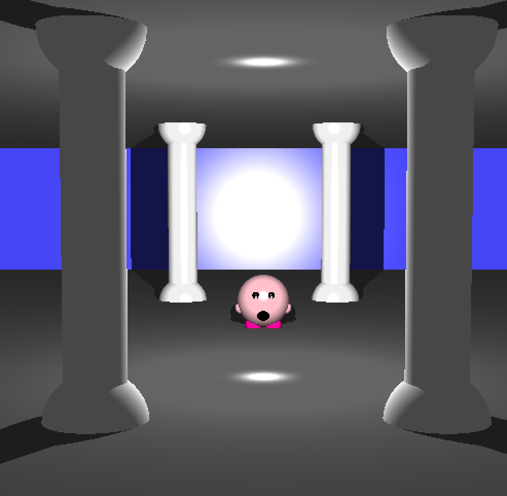
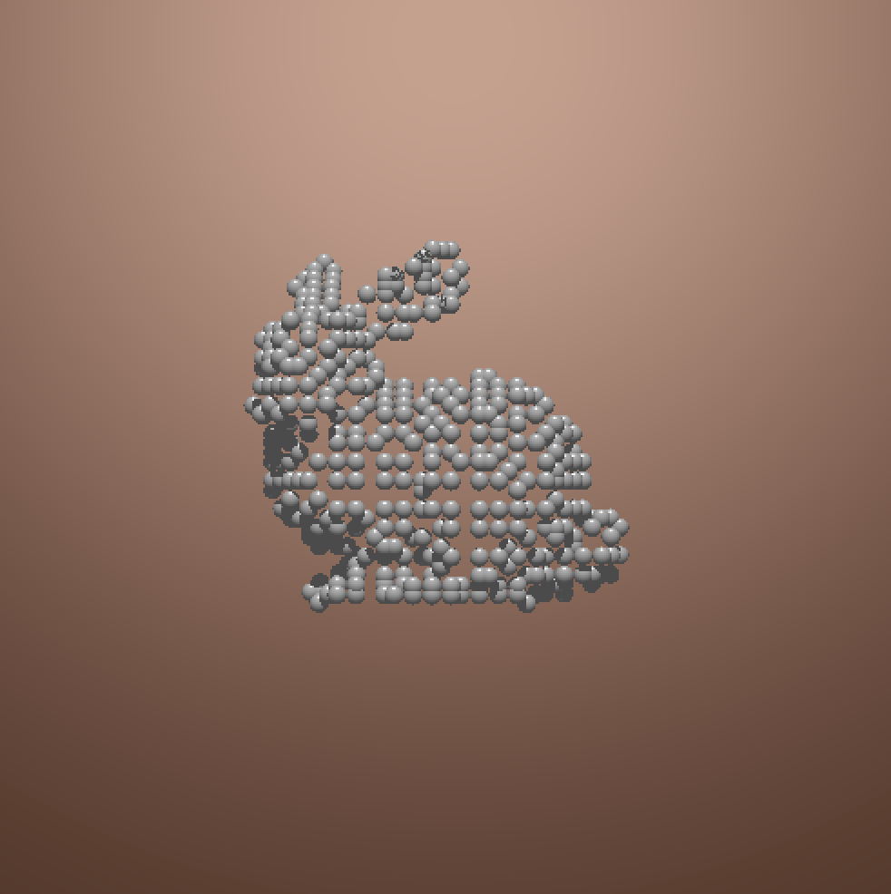

# MiniRT 

The MiniRT project is a minimalist ray-tracing engine built using fixed-point arithmetic in C. This compact yet powerful engine renders 3D scenes with realistic lighting and shadows, while leveraging the precision and performance benefits of fixed-point number representation. Designed with simplicity and efficiency in mind, MiniRT demonstrates the potential of ray-tracing techniques in resource-constrained environments, using the new updated Codam's version of the MLX42[^1].
## This is a RayTracer in C
Made for UNIX systems, Linux and MacOs
- With implementation of fixed point numbers
- With Phong reflexion
- Light colors

- Paper style shapes with light passing through one side.
    - Spheres
    - Cylinders
    - Planes
## Compile
`$>make` in main repo
 - It will build the Codam's MLX42[^1] in the include repo depending on OS and detect if GLFW[^2] is installed. 
## Run
ex: `./miniRT scene/columns.rt`
## How to make a scene
Ambient lightning:    

    A 0.2 255,255,255

    -identifier: A
    -ambient lighting ratio in range [0.0,1.0]: 0.2
    -R,G,B colors in range [0-255]: 255, 255, 255

Camera:

    C -50.0,0,20    0,0,1    70

    -identifier: C
    -x,y,z coordinates of the view point: 0.0,0.0,20.6
    -3d normalized orientation vector. In range [-1,1] for each x,y,z axis: 0.0,0.0,1.0
    -FOV : Horizontal field of view in degrees in range [0,180]

Light:

    L -40.0,50.0,0.0    0.6    10,0,255

    -identifier: L
    -x,y,z coordinates of the light point: 0.0,0.0,20.6
    -the light brightness ratio in range [0.0,1.0]: 0.6
    -R,G,B colors in range [0-255]: 10, 0, 255

Sphere:

    sp 0.0,0.0,20.6    12.6    10,0,255
    
    -identifier: sp
    -x,y,z coordinates of the sphere center: 0.0,0.0,20.6
    -the sphere diameter: 12.6
    -R,G,B colors in range [0-255]: 10, 0, 255

Plane:

    pl 0.0,0.0,-10.0    0.0,1.0,0.0    0,0,225
    
    -identifier: pl
    -x,y,z coordinates: 0.0,0.0,-10.0
    -3d normalized orientation vector. In range [-1,1] for each x,y,z axis: 0.0,0.0,1.0
    -R,G,B colors in range [0-255]: 0, 0, 255

Cylinder:

    cy    50.0,0.0,20.6    0.0,0.0,1.0    14.2    21.42    10,0,255
    
    -identifier: cy
    -x,y,z coordinates: 50.0,0.0,20.6
    -3d normalized orientation vector. In range [-1,1] for each x,y,z axis:    0.0,0.0,1.0
    -the cylinder diameter: 14.2
    -the cylinder height: 21.42
    -R,G,B colors in range [0,255]: 10, 0, 255

## Controls
 - Toggle: Press a key to activate the toggled trigger, then increment with `+` or `-`.
 - Select an object, then change its properties
    - Click on a shape
        - Drag and drop to move an object on the Y and Z axis.
        - Toggle `x`, `y` and/or `z`, then `+` or `-` to change position.
        - Toggle `o` then `x`, `y` and/or `z` then `+` or `-` to change orientation.
        - Toggle `r` then `+` or `-` to change radius for the sphere and cylinder.
        - Toggle `h` then `+` or `-` to change height for the cylinder.
    - Press `a` to toggle the ambient light
        - Change the color red(`1`), green(`2`), blue(`3`).
        - `+` or `-` to change the light intensity.
    - Press `l` to toggle the light
        - Click anywhere to change its position on the Y and Z axis.
        - Toggle `x`, `y` and/or `z`, then `+` or `-` to change position.
        - Toggle `r` to change its radiance/brightness.
    - Press `c` to toggle the camera
        - Toggle `x`, `y` and/or `z`, then `+` or `-` to change position.
        - Toggle `o` then `x`, `y` and/or `z` then `+` or `-` to change orientation.
        - Toggle `f` then `+` or `-` to change field of view.
## Examples :
 - `phong_demo.rt`
 
 - `columns.rt`

 - `spot.rt`

 - Why not cloud point data: `pcd.rt`

### Made by :
- [ast-jean](https://github.com/ast-jean)

- [mtrembla](https://github.com/Zelxopi)

- [slavoie](https://github.com/Steven1659139)

[^1]:[Codam's MLX42: https://github.com/codam-coding-college/MLX42](https://github.com/codam-coding-college/MLX42)

[^2]:[GLFW used by Codam's MLX42: https://www.glfw.org/](https://www.glfw.org/)
